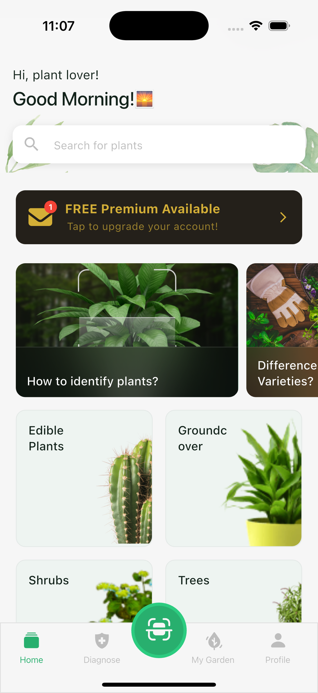
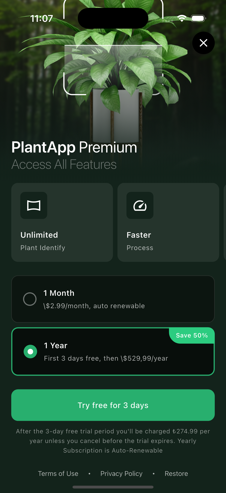
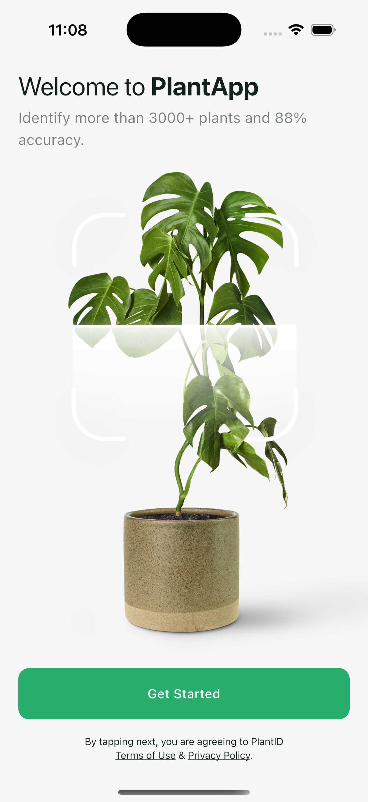

# 🌿 Plant Scope

A Flutter application for plant identification and care management using Clean Architecture and BLoC pattern.

## 📱 Features

- 🔍 Plant identification through questions
- 🏡 Plant care management
- 💎 Premium subscription system
- 🌍 Multi-language support
- 📚 Onboarding for new users

## 🛠️ Tech Stack

- **Flutter**: 3.35.7
- **Dart**: 3.9.2
- **DevTools**: 2.48.0

### Key Dependencies
- `flutter_bloc` ^9.1.1 - State management
- `get_it` ^9.0.5 - Dependency injection
- `go_router` ^17.0.0 - Navigation
- `dio` ^5.9.0 - HTTP client
- `dartz` ^0.10.1 - Functional programming
- `easy_localization` ^3.0.8 - Internationalization

### Testing
- `bloc_test` ^10.0.0 - BLoC testing
- `mocktail` ^1.0.4 - Mocking (no code generation)

## 🚀 Getting Started

### Prerequisites
- Flutter SDK 3.35.7+
- Dart SDK 3.9.2+
- iOS: Xcode 15+ (macOS only)
- Android: Android Studio or VS Code with Flutter extension

### Installation

```bash
# Clone the repository
git clone https://github.com/kahveciogluo/plant_scope.git
cd plant_scope

# Install dependencies
flutter pub get
```

### ⚙️ Environment Setup 

Create a `.env` file in the **project root directory**:

```env
BASE_URL=https://api.example.com
API_KEY=your_api_key_here
```

> 📍 **Location**: Place `.env` file at `/plant_scope/.env` (same level as `pubspec.yaml`)

### 🏃 Run the App

```bash
# Generate code (Freezed, JSON serialization)
dart run build_runner build --delete-conflicting-outputs

# Run the app
flutter run
```

## 🧪 Testing

```bash
# Run all tests
flutter test

# Run with coverage
flutter test --coverage

# Run specific test
flutter test test/features/home/presentation/bloc/home_bloc_test.dart
```

## 🏗️ Architecture

This project follows **Clean Architecture** principles with feature-based modularization:

```
lib/
├── core/              # Core utilities and managers
├── features/          # Feature modules (home, payment, splash, etc.)
│   └── feature_name/
│       ├── data/      # Models, repositories, data sources
│       ├── domain/    # Entities, use cases
│       └── presentation/  # BLoC/Cubit, pages, widgets
└── injection_container.dart  # Dependency injection setup
```

For detailed architecture documentation, see [ARCHITECTURE.md](./ARCHITECTURE.md)

## 📚 Documentation

- [ARCHITECTURE.md](./ARCHITECTURE.md) - Complete architecture guide
- [TEST_COVERAGE.md](./TEST_COVERAGE.md) - Testing documentation and coverage

## 🔧 Development

```bash
# Format code
dart format .

# Analyze code
flutter analyze

# Clean build artifacts
flutter clean

# Watch mode for code generation
dart run build_runner watch
```

## 📦 Building

```bash
# Android APK
flutter build apk --release

# Android App Bundle
flutter build appbundle --release

# iOS (requires macOS)
flutter build ipa --release
```

## 🤝 Contributing

1. Fork the repository
2. Create your feature branch (`git checkout -b feature/amazing-feature`)
3. Commit your changes (`git commit -m 'Add amazing feature'`)
4. Push to the branch (`git push origin feature/amazing-feature`)
5. Open a Pull Request

## 📄 License

This project is licensed under the MIT License.

## 👨‍💻 Author

**Kahvecioğlu**
- GitHub: [@kahveciogluo](https://github.com/kahveciogluo)

---

## 📱 Screenshots

<p align="center">
  
  
  
</p>
